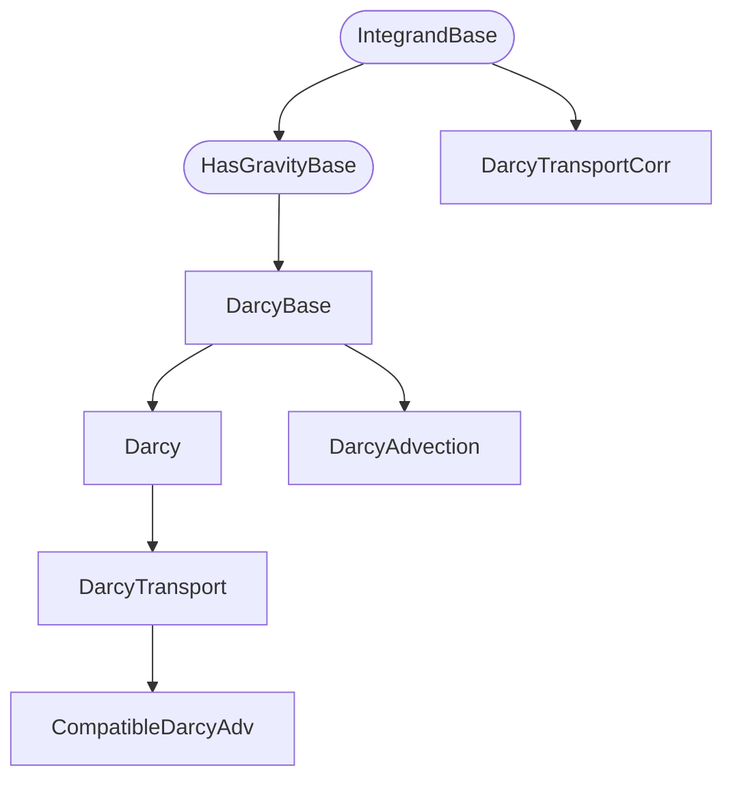
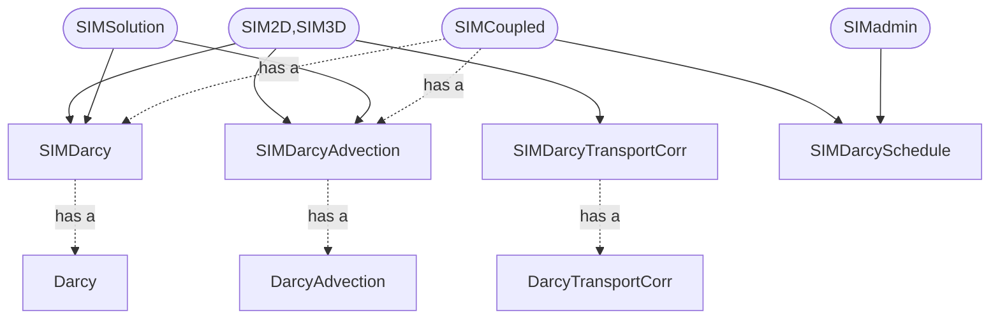

## Introduction

This repository contains applications for solving Darcy flow problems,
built using the [IFEM](https://github.com/OPM/IFEM) library.

### Getting all dependencies

1. Install IFEM from https://github.com/OPM/IFEM

### Getting the code

This is done by first navigating to a folder `<App root>` in which you want
the IFEM applications and typing

    git clone https://github.com/OPM/IFEM-Darcy

### Compiling the code

To compile, first navigate to the root catalogue `<App root>`.

    cd IFEM-Darcy
    mkdir Debug
    cd Debug
    cmake -DCMAKE_BUILD_TYPE=Debug ..
    make

This will compile the library and the Darcy applications.
The executbales can be found in the `bin` subfolder.
Change all instances of `Debug` with `Release` to drop debug-symbols,
and get a faster running code.

### Testing the code

IFEM is using cmake test system.
To compile and run all regression- and unit-tests, navigate to your build folder
(i.e., `<App root>/IFEM-Darcy/Debug`) and type

    make check

## Class overview

The integrands of the Darcy problem
is organized in the following class hierarcy:

The simulation drivers are connected to the integrands as follows:

